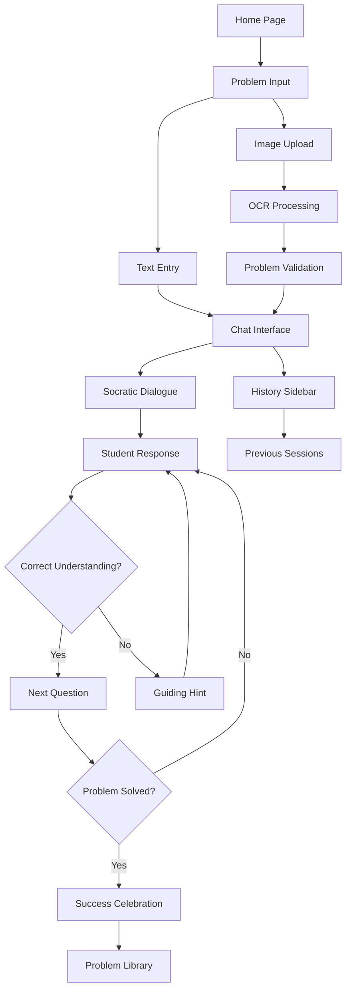

# SocraTeach - AI Math Tutor Product Requirements Document

## 1. Product Overview

SocraTeach is an AI-powered math tutor that guides students through problem-solving using Socratic questioning methodology, similar to the OpenAI x Khan Academy demonstration. <mcreference link="https://www.youtube.com/watch?v=IvXZCocyU_M" index="0">0</mcreference> The system accepts math problems via text input or image upload and helps students discover solutions through guided dialogue without providing direct answers.

The product addresses the need for personalized, patient tutoring that develops critical thinking skills rather than just providing solutions. Target users include K-12 students, homeschool families, and educators seeking interactive learning tools.

Market value: Democratizes access to high-quality Socratic tutoring, potentially reaching millions of students who lack access to personalized math instruction.

## 2. Core Features

### 2.1 User Roles

| Role | Registration Method | Core Permissions |
|------|---------------------|------------------|
| Student | Email registration or guest access | Can submit problems, engage in dialogue, view conversation history |
| Educator | Email registration with verification | Can monitor student progress, access analytics, create custom problem sets |

### 2.2 Feature Module

Our SocraTeach application consists of the following main pages:
1. **Home Page**: Welcome interface, problem input options (text/image), quick start tutorial
2. **Chat Interface**: Main tutoring conversation, math rendering, conversation history sidebar
3. **Problem Library**: Browse example problems, difficulty levels, subject categories
4. **Profile Dashboard**: User progress tracking, conversation history, settings
5. **Upload Interface**: Image capture/upload, OCR processing, problem confirmation

### 2.3 Page Details

| Page Name | Module Name | Feature description |
|-----------|-------------|---------------------|
| Home Page | Welcome Section | Display app introduction, value proposition, and navigation to main features |
| Home Page | Problem Input | Provide text input field and image upload button for problem submission |
| Home Page | Quick Tutorial | Show interactive demo of Socratic dialogue process with sample problem |
| Chat Interface | Conversation Display | Render multi-turn dialogue with proper math equation formatting using LaTeX/KaTeX |
| Chat Interface | Input Controls | Text input for student responses, image upload for follow-up problems |
| Chat Interface | History Sidebar | Show previous conversations, allow resuming past sessions |
| Chat Interface | Hint System | Provide progressive hints when student is stuck for 2+ turns |
| Problem Library | Category Browser | Filter problems by subject (algebra, geometry, arithmetic, word problems) |
| Problem Library | Difficulty Selector | Choose problems by grade level or complexity |
| Problem Library | Sample Solutions | Show example Socratic dialogues for reference (without direct answers) |
| Profile Dashboard | Progress Tracking | Display solved problems, time spent, improvement metrics |
| Profile Dashboard | Conversation Archive | Access and review past tutoring sessions |
| Profile Dashboard | Settings Panel | Configure difficulty preferences, notification settings |
| Upload Interface | Image Capture | Camera integration for mobile devices, file upload for desktop |
| Upload Interface | OCR Processing | Extract text from images using Vision LLM, display parsed problem for confirmation |
| Upload Interface | Problem Validation | Allow editing of parsed text before starting tutoring session |

## 3. Core Process

**Student Learning Flow:**
Students begin by submitting a math problem through text input or image upload. The system parses the problem and initiates a Socratic dialogue by asking guiding questions like "What information do we have?" and "What are we trying to find?" The AI tutor maintains conversation context, validates student responses, and provides progressive hints without giving direct answers. The session concludes when the student successfully solves the problem or requests to end.

**Educator Monitoring Flow:**
Educators can create accounts to monitor student progress, review conversation transcripts, and access analytics on learning patterns. They can also create custom problem sets for their students.

## 4. User Interface Design

### 4.1 Design Style

- **Primary Colors**: Deep blue (#1e40af) for trust and learning, warm orange (#f97316) for encouragement
- **Secondary Colors**: Light gray (#f8fafc) backgrounds, green (#10b981) for success states
- **Button Style**: Rounded corners (8px radius), subtle shadows, hover animations
- **Font**: Inter or similar clean sans-serif, 16px base size, 18px for chat messages
- **Layout Style**: Card-based design with clean spacing, top navigation with breadcrumbs
- **Icons**: Friendly, educational icons (📚, 🤔, 💡) with consistent line style

### 4.2 Page Design Overview

| Page Name | Module Name | UI Elements |
|-----------|-------------|-------------|
| Home Page | Welcome Section | Hero banner with animated math equations background, clear call-to-action buttons |
| Home Page | Problem Input | Large text area with placeholder "Enter your math problem here...", prominent upload button with drag-and-drop zone |
| Chat Interface | Conversation Display | WhatsApp-style chat bubbles, student messages on right (blue), tutor on left (gray), math rendered inline |
| Chat Interface | Input Controls | Fixed bottom input bar, send button, attachment icon, typing indicators |
| Problem Library | Category Grid | Card layout with subject icons, problem count badges, difficulty color coding |
| Profile Dashboard | Progress Cards | Statistics cards with charts, recent activity timeline, achievement badges |
| Upload Interface | Camera View | Full-screen camera interface with capture button, gallery access, crop/rotate tools |

### 4.3 Responsiveness

The application is mobile-first with responsive design optimizing for both smartphone and desktop use. Touch interactions are optimized for mobile problem input and image capture, while desktop users benefit from keyboard shortcuts and larger display areas for complex equations.

## 5. Success Metrics

### 5.1 Pedagogical Quality (35%)
- Students solve problems without receiving direct answers in 90%+ of sessions
- Average of 5+ guiding questions per problem before solution
- Student self-reports increased understanding in post-session surveys
- Successful completion of 5+ different problem types (arithmetic, algebra, geometry, word problems, multi-step)

### 5.2 Technical Implementation (30%)
- OCR accuracy of 95%+ for printed math problems
- Conversation context maintained across 10+ turn dialogues
- Math rendering displays correctly across all supported browsers
- System response time under 2 seconds for text input, under 5 seconds for image processing

### 5.3 User Experience (20%)
- Intuitive interface with minimal onboarding required
- Mobile-responsive design with touch-optimized controls
- Conversation history accessible and searchable
- Error handling with clear user feedback

### 5.4 Innovation (15%)
- Implementation of stretch features (whiteboard, voice interface, step visualization)
- Creative use of AI for adaptive questioning based on student responses
- Novel approaches to visual problem representation

## 6. Implementation Phases

### Phase 1 (Days 1-2): Foundation
- Basic chat interface with hardcoded problems
- LLM integration with Socratic prompting
- Text input problem parsing
- Core dialogue engine

### Phase 2 (Days 3-4): Core Features
- Image upload and OCR processing
- Math rendering with KaTeX
- Conversation history and context management
- UI polish and responsive design

### Phase 3 (Day 5): Testing & Deployment
- Testing with 5+ problem types
- Performance optimization
- Documentation and demo preparation
- Deployment setup

### Phase 4 (Days 6-7): Stretch Features (Optional)
- Interactive whiteboard implementation
- Voice interface integration
- Step visualization animations
- Animated avatar system