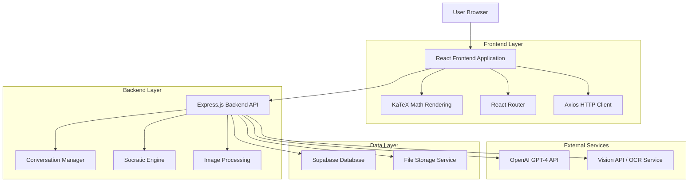
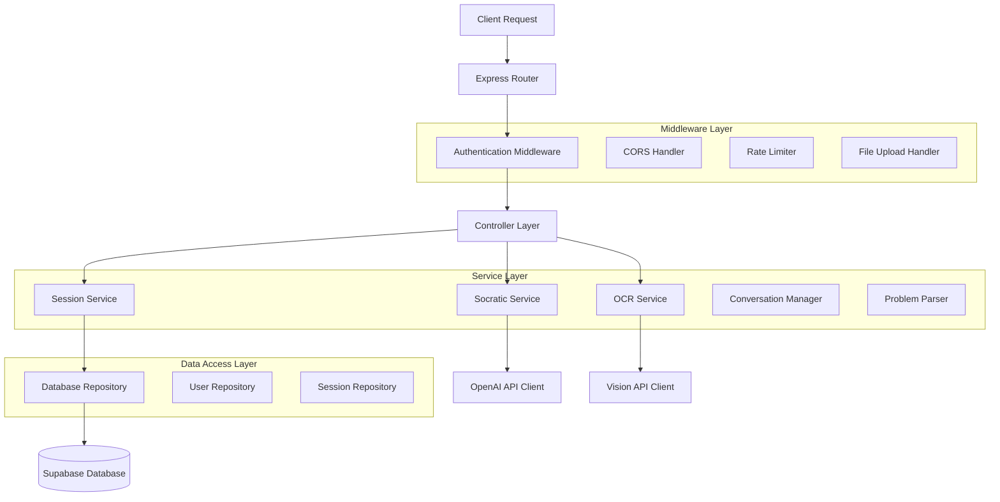
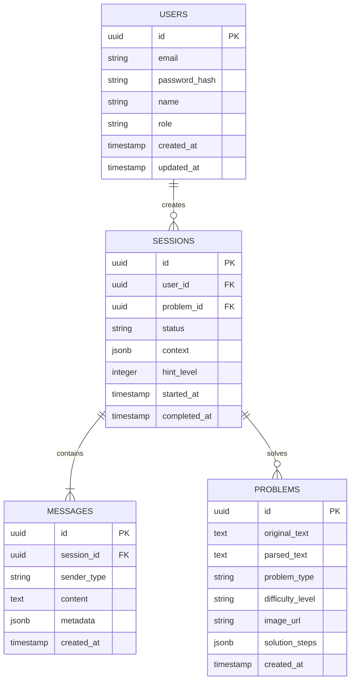

# SocraTeach - Technical Architecture Document

## 1. Architecture Design



## 2. Technology Description

- Frontend: React@18 + TypeScript + Tailwind CSS + Vite + KaTeX
- Backend: Express.js@4 + TypeScript + Node.js@18
- Database: Supabase (PostgreSQL)
- AI Services: OpenAI GPT-4 API + Vision API
- File Storage: Supabase Storage
- Math Rendering: KaTeX@0.16
- Image Processing: Sharp + Multer

## 3. Route Definitions

| Route | Purpose |
|-------|---------|
| / | Home page with problem input options and tutorial |
| /chat | Main tutoring interface with conversation display |
| /chat/:sessionId | Resume specific tutoring session |
| /library | Browse problem categories and examples |
| /profile | User dashboard with progress and history |
| /upload | Image capture and OCR processing interface |
| /auth/login | User authentication page |
| /auth/register | User registration page |

## 4. API Definitions

### 4.1 Core API

**Authentication**
```
POST /api/auth/register
```

Request:
| Param Name | Param Type | isRequired | Description |
|------------|------------|------------|-------------|
| email | string | true | User email address |
| password | string | true | User password (min 8 characters) |
| name | string | true | User display name |
| role | string | false | User role (student/educator, defaults to student) |

Response:
| Param Name | Param Type | Description |
|------------|------------|-------------|
| success | boolean | Registration status |
| user | object | User profile data |
| token | string | JWT authentication token |

**Problem Submission**
```
POST /api/problems/submit
```

Request:
| Param Name | Param Type | isRequired | Description |
|------------|------------|------------|-------------|
| content | string | false | Text-based math problem |
| image | file | false | Image file containing math problem |
| sessionId | string | false | Existing session ID to continue |

Response:
| Param Name | Param Type | Description |
|------------|------------|-------------|
| sessionId | string | Unique session identifier |
| parsedProblem | string | Extracted/processed problem text |
| initialResponse | string | First Socratic question from tutor |

**Conversation Management**
```
POST /api/chat/respond
```

Request:
| Param Name | Param Type | isRequired | Description |
|------------|------------|------------|-------------|
| sessionId | string | true | Session identifier |
| studentResponse | string | true | Student's answer or question |
| timestamp | string | true | ISO timestamp of response |

Response:
| Param Name | Param Type | Description |
|------------|------------|-------------|
| tutorResponse | string | Next Socratic question or guidance |
| isComplete | boolean | Whether problem is solved |
| hintLevel | number | Current hint progression (0-3) |
| context | object | Updated conversation context |

**Session History**
```
GET /api/sessions/:userId
```

Response:
| Param Name | Param Type | Description |
|------------|------------|-------------|
| sessions | array | List of user's tutoring sessions |
| totalProblems | number | Count of completed problems |
| averageTime | number | Average session duration in minutes |

Example Request:
```json
{
  "content": "Solve for x: 2x + 5 = 13",
  "sessionId": null
}
```

Example Response:
```json
{
  "sessionId": "sess_abc123",
  "parsedProblem": "2x + 5 = 13",
  "initialResponse": "I see you have an equation to solve! Before we start, what do you think we're trying to find in this problem?"
}
```

## 5. Server Architecture Diagram



## 6. Data Model

### 6.1 Data Model Definition



### 6.2 Data Definition Language

**Users Table**
```sql
-- Create users table
CREATE TABLE users (
    id UUID PRIMARY KEY DEFAULT gen_random_uuid(),
    email VARCHAR(255) UNIQUE NOT NULL,
    password_hash VARCHAR(255) NOT NULL,
    name VARCHAR(100) NOT NULL,
    role VARCHAR(20) DEFAULT 'student' CHECK (role IN ('student', 'educator')),
    created_at TIMESTAMP WITH TIME ZONE DEFAULT NOW(),
    updated_at TIMESTAMP WITH TIME ZONE DEFAULT NOW()
);

-- Create indexes
CREATE INDEX idx_users_email ON users(email);
CREATE INDEX idx_users_role ON users(role);

-- Row Level Security
ALTER TABLE users ENABLE ROW LEVEL SECURITY;
GRANT SELECT, INSERT, UPDATE ON users TO authenticated;
GRANT SELECT ON users TO anon;
```

**Problems Table**
```sql
-- Create problems table
CREATE TABLE problems (
    id UUID PRIMARY KEY DEFAULT gen_random_uuid(),
    original_text TEXT,
    parsed_text TEXT NOT NULL,
    problem_type VARCHAR(50) NOT NULL,
    difficulty_level VARCHAR(20) DEFAULT 'medium',
    image_url TEXT,
    solution_steps JSONB,
    created_at TIMESTAMP WITH TIME ZONE DEFAULT NOW()
);

-- Create indexes
CREATE INDEX idx_problems_type ON problems(problem_type);
CREATE INDEX idx_problems_difficulty ON problems(difficulty_level);
CREATE INDEX idx_problems_created_at ON problems(created_at DESC);

-- Row Level Security
ALTER TABLE problems ENABLE ROW LEVEL SECURITY;
GRANT SELECT ON problems TO anon;
GRANT ALL PRIVILEGES ON problems TO authenticated;
```

**Sessions Table**
```sql
-- Create sessions table
CREATE TABLE sessions (
    id UUID PRIMARY KEY DEFAULT gen_random_uuid(),
    user_id UUID REFERENCES users(id) ON DELETE CASCADE,
    problem_id UUID REFERENCES problems(id) ON DELETE SET NULL,
    status VARCHAR(20) DEFAULT 'active' CHECK (status IN ('active', 'completed', 'abandoned')),
    context JSONB DEFAULT '{}',
    hint_level INTEGER DEFAULT 0,
    started_at TIMESTAMP WITH TIME ZONE DEFAULT NOW(),
    completed_at TIMESTAMP WITH TIME ZONE
);

-- Create indexes
CREATE INDEX idx_sessions_user_id ON sessions(user_id);
CREATE INDEX idx_sessions_status ON sessions(status);
CREATE INDEX idx_sessions_started_at ON sessions(started_at DESC);

-- Row Level Security
ALTER TABLE sessions ENABLE ROW LEVEL SECURITY;
GRANT ALL PRIVILEGES ON sessions TO authenticated;
```

**Messages Table**
```sql
-- Create messages table
CREATE TABLE messages (
    id UUID PRIMARY KEY DEFAULT gen_random_uuid(),
    session_id UUID REFERENCES sessions(id) ON DELETE CASCADE,
    sender_type VARCHAR(10) NOT NULL CHECK (sender_type IN ('student', 'tutor')),
    content TEXT NOT NULL,
    metadata JSONB DEFAULT '{}',
    created_at TIMESTAMP WITH TIME ZONE DEFAULT NOW()
);

-- Create indexes
CREATE INDEX idx_messages_session_id ON messages(session_id);
CREATE INDEX idx_messages_created_at ON messages(created_at);

-- Row Level Security
ALTER TABLE messages ENABLE ROW LEVEL SECURITY;
GRANT ALL PRIVILEGES ON messages TO authenticated;

-- Initial data
INSERT INTO problems (parsed_text, problem_type, difficulty_level, solution_steps) VALUES
('2x + 5 = 13', 'algebra', 'beginner', '{"steps": ["Subtract 5 from both sides", "Divide by 2"]}'),
('Find the area of a triangle with base 8 and height 6', 'geometry', 'beginner', '{"steps": ["Use formula A = (1/2) * base * height", "Substitute values"]}'),
('If 3 apples cost $2.40, how much do 5 apples cost?', 'word_problem', 'intermediate', '{"steps": ["Find cost per apple", "Multiply by 5"]}');
```

## 7. Implementation Guidelines

### 7.1 Socratic Engine Design

The Socratic Engine is the core component that generates guiding questions without providing direct answers. It maintains conversation context and adapts questioning based on student responses.

**Key Components:**
- **Context Manager**: Tracks problem state, student understanding level, and conversation history
- **Question Generator**: Creates appropriate Socratic questions based on current context
- **Response Validator**: Analyzes student responses to determine understanding level
- **Hint System**: Provides progressive hints when students are stuck for 2+ turns

### 7.2 Security Considerations

- API rate limiting to prevent abuse
- Input sanitization for all user-generated content
- Secure file upload with type validation
- JWT token authentication with refresh mechanism
- Environment variables for all API keys and secrets

### 7.3 Performance Optimization

- Response caching for common problem types
- Image compression before OCR processing
- Database connection pooling
- Lazy loading for conversation history
- CDN integration for static assets